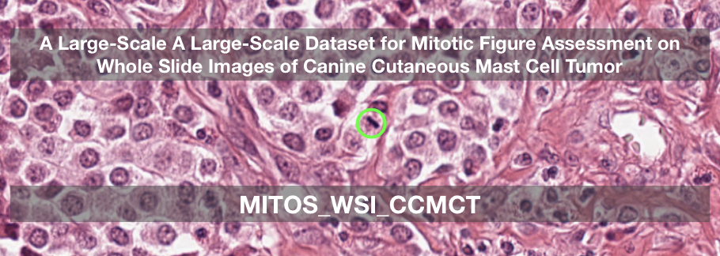

# Large-Scale Canine Cutaneous Mast Cell Tumor Data Set for Mitotic Figure Assessment on Whole Slide Images
## MITOS_WSI_CCMCT data set

This repository contains all code needed to derive the Technical Validation of our paper submitted to Sci Data. 

It contains two main parts:

### Data set variant evaluation

This folder contains the evaluation for all variants, i.e. the manually labelled (MEL), the hard-example-augmented manually labelled (HEAEL) and the object-detection augmented manually expert labelled (ODAEL) variant.

Main results of the data set variants based on a one- and two-stage-detector can be found in [Evaluation.ipynb](Evaluation.ipynb).

### Ablation Study

One main question behind our research was: How big does a data set need to be? In order to find out, we reduced the set both in quantity of WSIs and area. All previous data sets typically had an annotated area of around 10 High Power Fields (approx 2 square millimeters) per tumor. We assumed that this would not be enough to account for all data variance, and were able to show this for our data set.

Main results of the ablation study were calculated in the ipython notebook: [AblationStudy_Evaluation.ipynb](AblationStudy_Evaluation.ipynb)

## Training notebooks

The training process can be seen in the notebooks for the respective dataset variants:

[RetinaNet-CCMCT-MEL.ipynb](RetinaNet-CCMCT-MEL.ipynb)

[RetinaNet-CCMCT-HEAEL.ipynb](RetinaNet-CCMCT-HEAEL.ipynb)

[RetinaNet-CCMCT-ODAEL.ipynb](RetinaNet-CCMCT-ODAEL.ipynb)

Note: The results (as submitted) were done with a previous version of the notebook, which was afterwards simplified and cleaned up. However, besides the random factor in sampling, there should be no difference between the networks generated with these notebooks and the ones used for the manuscript.
